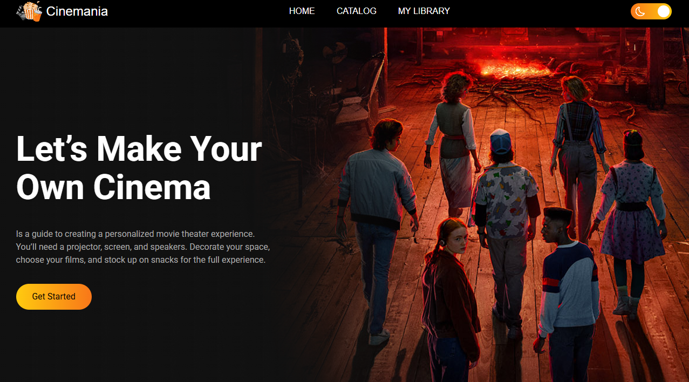
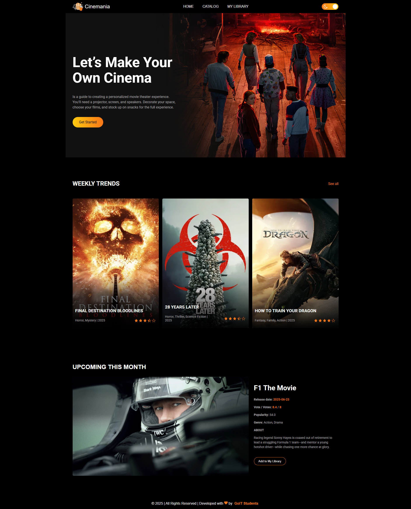

# 🎬 Cinemania

**Cinemania**, modern ve kullanıcı dostu bir film keşif platformudur. Popüler ve trend filmleri incele, detaylarını öğren, yıldız ver ve favorilerine ekle! 🍿

---

## ✨ Özellikler

- 🔍 Günlük ve haftalık popüler filmler
- 🎞️ Film detay modalı (poster, açıklama, puan, popülerlik)
- ⭐ Dinamik yıldız derecelendirme (SVG)
- 📚 My Library (Favori listesi, localStorage destekli)
- 🎧 Modal açılış/kapanış ses efektleri
- 📱 Responsive tasarım

---

## 🚀 Canlı Uygulama

👉 [Projeyi Görüntüle](https://nan-stop-us.github.io/cinemania/)

---

## 🖼️ Ekran Görüntüleri

### 🏠 Home 

### 📈 Catalog

### 🧾 Library

---

## 🛠️ Kullanılan Teknolojiler

- **HTML5**, **CSS3**, **JavaScript (Vanilla JS)**
- **TMDB API** (The Movie Database)
- **LocalStorage**
- **Responsive Design**

---

## 🙋‍♀️ Katkı Sağla

1. Forkla 🍴
2. Yeni bir branch oluştur (`git checkout -b feature/yenilik`)
3. Değişiklik yap & commit et
4. Branch’i pushla (`git push origin feature/yenilik`)
5. Pull request oluştur

---

## 👨‍💻 Geliştirici

**Deniz Can Özder** 🔗 [LinkedIn](https://www.linkedin.com/in/denizozder1/) | 🌐 [GitHub](https://github.com/DenizzOzder)

**Mesut Güzel** 🔗 [LinkedIn](https://linkedin.com) | 🌐 [GitHub](https://github.com/MesutGzlz)

**Arda Tinmaz** 🔗 [LinkedIn](https://www.linkedin.com/in/ardatinmaz/) | 🌐 [GitHub](https://github.com/ArdaTinmaz)

**Yusuf Şengöz** 🔗 [LinkedIn](https://www.linkedin.com/in/yusuf-şengöz-a7213525b/) | 🌐 [GitHub](https://github.com/zekirovskii)

**Ahmet Canbaz** 🔗 [LinkedIn](https://www.linkedin.com/in/ahmet-canbaz/) | 🌐 [GitHub](https://github.com/canbazahmet)  

**Ayşegül Arslan** 🔗 [LinkedIn](https://www.linkedin.com/in/ayşegül-arslan-19a135279/) | 🌐 [GitHub](https://github.com/aysegularslan1)

**Caner Kesici** 🔗 [LinkedIn](https://www.linkedin.com/in/caner-kesici/) | 🌐 [GitHub](https://github.com/Canerksc)

**Derya Almaz** 🔗 [LinkedIn](https://www.linkedin.com/in/deryaalmaz/) | 🌐 [GitHub](https://github.com/deryalmaz)

**Ebu Demirkazık** 🔗 [LinkedIn](https://www.linkedin.com/in/ebudemirkazik/) | 🌐 [GitHub](https://github.com/ebudemirkazik) 

**Rabia Altınok** 🔗 [LinkedIn](https://www.linkedin.com/in/rabia-altınok-853838255/) | 🌐 [GitHub](https://github.com/rabiaaltnk) 

**Bilal Fırtına** 🔗 [LinkedIn](https://www.linkedin.com/in/bilal-firtina/) | 🌐 [GitHub](https://github.com/BilalFirtina) 

---

> 🎉 Cinemania ile sinema keyfi her zaman seninle!

---

